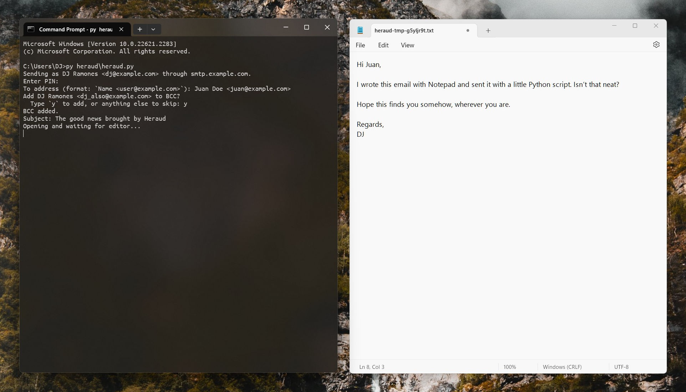

# Heraud

A plain-text SMTP sending tool for Windows.

This simple Python script stores your SMTP account details to disk (securely protected with a PIN using [Fernet](https://cryptography.io/en/latest/fernet/) cryptography) and lets you compose your email with the good old Windows Notepad.

It’s a convenience tool you might find neat if, for example, you have an account set up with an SMTP service provider such as Amazon SES, Zoho Mail, or Mailgun, and occasionally want to fire off emails without opening full-featured email clients.

“[Heraud](https://en.wiktionary.org/wiki/heraud)” is Middle English for “herald”.

## Requirements

This tool is for Windows (tested with Windows 11). It assumes that the `py` launcher is available, as it uses a shebang line (that the launcher [enables on Windows](https://docs.python.org/3/using/windows.html#shebang-lines)) to run in a virtual environment. The shebang line in turn assumes that the virtual environment is installed in a `venv` directory next to `heraud.py` (e.g., created with `py -m venv venv`). The virtual environment is to be populated with `pip install -r requirements-lock.txt`. (For an explanation of the `requirements*.txt` files, see “[A lightweight pip workflow](https://tech.reversedelay.net/2023/07/a-lightweight-python-pip-workflow/)”.)

Of course, if you’re the type to actually use this tool, you can ignore all that and use the script your way. You’ll probably want to keep the `cryptography` dependency up-to-date, for instance.

This tool is tested with Python 3.11, although older versions will probably work too.
